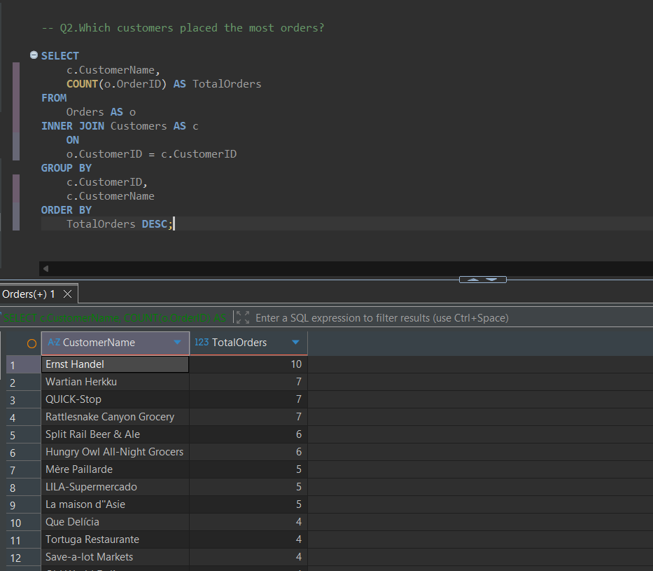
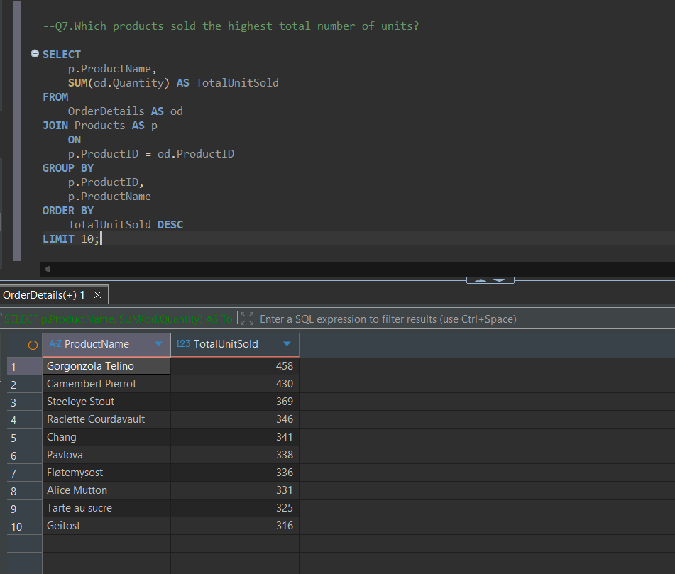
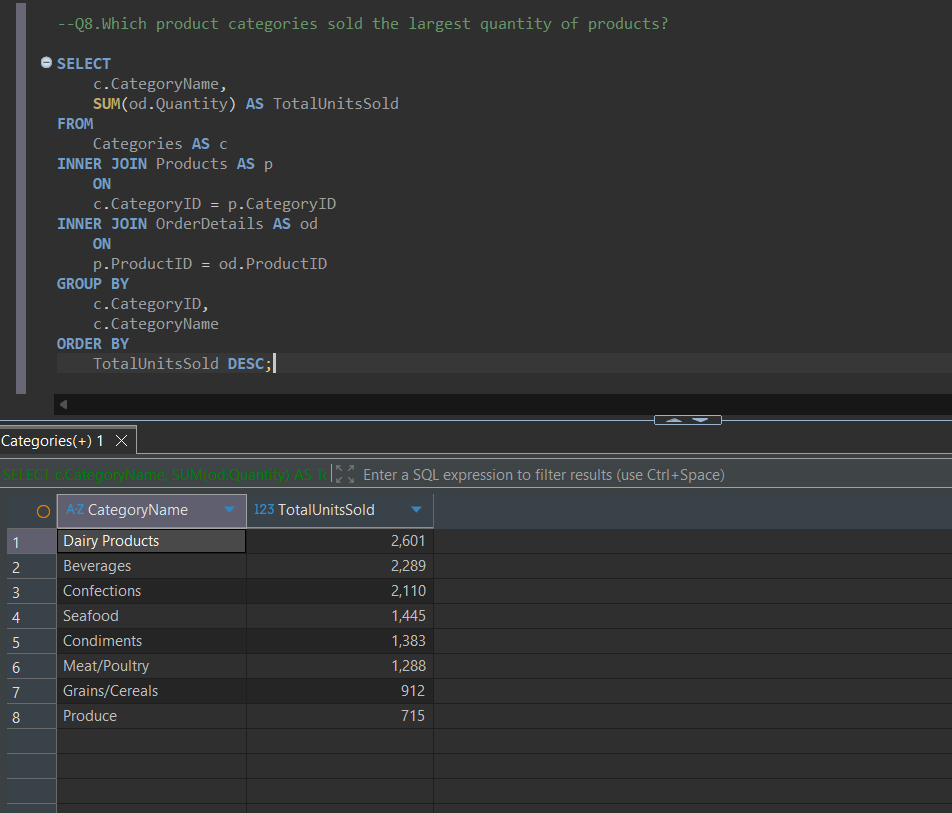

# Northwind Sales & Operations Analysis | SQL + DuckDB

## Project Overview

This project analyzes the Northwind relational database using SQL and DuckDB to explore customer activity, product demand, supplier relationships, and operational performance.

The objective of the project is to demonstrate how SQL can be used to answer practical business questions by querying and combining data from multiple related tables.

---

## Business Problem

A business with customers, products, suppliers, employees, and shipping operations needs a clear understanding of how different areas of the business are performing.

This analysis focuses on answering questions such as:

- Which customers place the most orders?
- Which products have the highest unit demand?
- Which product categories perform best?
- How can customers be segmented based on activity?
- Which suppliers provide the widest range of products?
- Which employees handle the most orders?
- Which shipping companies handle the highest order volume?
- Which customer markets are most important to individual employees?

The goal is to convert relational transaction data into useful business-level insights using SQL.

---

## Dataset

The project uses the Northwind sample relational database.

The main tables used in the analysis are:

- `Customers` – customer and geographic information
- `Orders` – order information linked to customers, employees, and shippers
- `OrderDetails` – products and quantities associated with each order
- `Products` – product information
- `Categories` – product category information
- `Suppliers` – supplier information
- `Employees` – employees responsible for orders
- `Shippers` – shipping companies used to fulfil orders

The relational structure allows customer, product, supplier, employee, and order data to be analyzed together using SQL joins.

---

## Tools & SQL Skills

**Tools**

- SQL
- DuckDB
- DBeaver
- MotherDuck

**SQL techniques demonstrated**

- SELECT and filtering
- INNER JOIN and LEFT JOIN
- Multi-table joins
- GROUP BY
- HAVING
- Aggregate functions such as COUNT and SUM
- CASE expressions
- Common Table Expressions (CTEs)
- Basic window functions
- RANK()
- PARTITION BY
- QUALIFY

The complete SQL analysis is available in [`northwind_sales_operations_analysis.sql`](northwind_sales_operations_analysis.sql).

---

# Analysis & Results

## 1. Top Customers by Number of Orders

Customer order activity was analyzed by joining the `Customers` and `Orders` tables and counting the number of orders associated with each customer.

**Result:**  
Ernst Handel recorded the highest number of orders in the dataset with **10 orders**. Wartian Herkku, QUICK-Stop, and Rattlesnake Canyon Grocery followed with **7 orders each**.

---

## 2. Best-Selling Products by Units

Product demand was analyzed by joining `Products` with `OrderDetails` and aggregating the total quantity ordered for each product.

**Result:**  
Gorgonzola Telino recorded the highest total unit demand with **458 units**, followed by Camembert Pierrot with **430 units** and Steeleye Stout with **369 units**.

---

## 3. Product Category Performance

A multi-table join between `Categories`, `Products`, and `OrderDetails` was used to compare total unit demand across product categories.

**Result:**  
Dairy Products generated the highest unit demand with **2,601 units**, followed by Beverages with **2,289 units** and Confections with **2,110 units**.

This indicates that demand is concentrated more heavily in these categories compared with categories such as Produce and Grains/Cereals.

---

## 4. Customer Activity Segmentation

Customers were segmented according to their order activity using aggregate functions and a `CASE` expression.

This analysis demonstrates how SQL can be used not only to retrieve data but also to create business-oriented customer classifications.

The segmentation thresholds used in this project are analytical assumptions for demonstration purposes rather than company-defined customer segments.

---

## 5. Employee and Customer-Market Analysis

A Common Table Expression (CTE) and window function were used to identify the customer country from which each employee handled the highest number of orders.

The analysis uses `RANK()`, `PARTITION BY`, and DuckDB's `QUALIFY` functionality to rank customer countries separately for each employee.

---

# Key Findings

- Ernst Handel was the most active customer by number of orders.
- Gorgonzola Telino recorded the highest product unit demand.
- Dairy Products, Beverages, and Confections were the three highest-volume product categories.
- Customer order activity varies considerably, allowing customers to be grouped into different activity segments.
- Multi-table relational analysis makes it possible to connect customer, product, employee, supplier, and operational information to answer business questions.

---

# Limitations

This analysis has several limitations:

- Northwind is a sample database and does not represent a current real-world business.
- The `OrderDetails` table in this database version does not contain historical transaction-level product prices. Therefore, this project focuses primarily on order counts and unit quantities rather than claiming accurate historical sales revenue or profit.
- Customer segmentation thresholds are analyst-defined and have not been validated against real business requirements.
- The analysis focuses primarily on descriptive SQL analysis and does not include forecasting or predictive modelling.

---

# Next Steps

Future improvements to this project could include:

- Expanding the analysis using additional CTEs and window functions.
- Adding date-based analysis to identify monthly or seasonal order trends.
- Performing additional customer and product ranking analysis.
- Running the analysis in MotherDuck as a cloud-based DuckDB workflow.
- Creating reusable SQL views for frequently used business metrics.
- Connecting the SQL analysis to Power BI to create an interactive dashboard.

---

## Author
**Kaveesha Dissanayake**
Aspiring Data Analyst | Power BI | SQL | Excel

**Kaveesha Dissanayake**

Aspiring Data Analyst | Power BI | SQL | Excel
